# **CURSO JAVA SCRIPT**
## Curso em Vídeo
## == Aula 01 ==

- Utilizando o Google Chrome:

-- Abrir o google Chrome;
- Botão direito do mouse na parte branca do navegador e clicar em inspecionar;

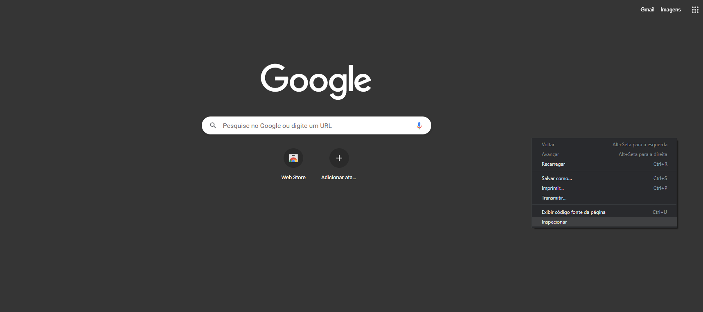

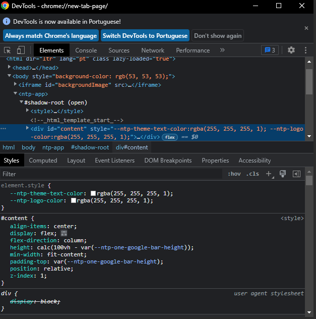

Em seguida, Clicar nos 3 pontinhos no canto superior direito:
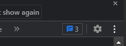

Clicar em **Undock into separate window**
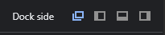

Em seguida: Clicar em **Console**:

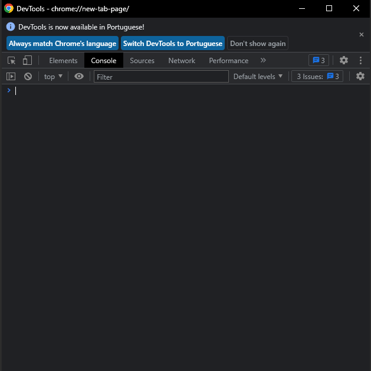

digite: alert ('OLÁ MUNDO!') e em seguida dê ENTER:

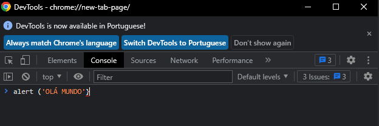

Após o enter, deverá aparecer a mensagem no google:

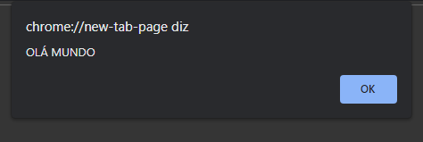

Outro exercicio:

mudar o fundo do Google: > document.body.style.background = 'black'

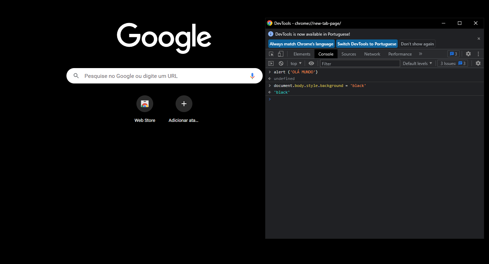

Mudando Texto do site: >document.quarySelector('NomeDotextoquedesejamudar').innerText = 'TextoNovoDesejado'

## AULA 02

ECMAScript = Versáo padronizada do JavaScript

**Bibliografia**

Para baixar e instalar:

- Node Js
- Google Chrome
- Visual Studio Code

## AULA 05
**Recapitulando**

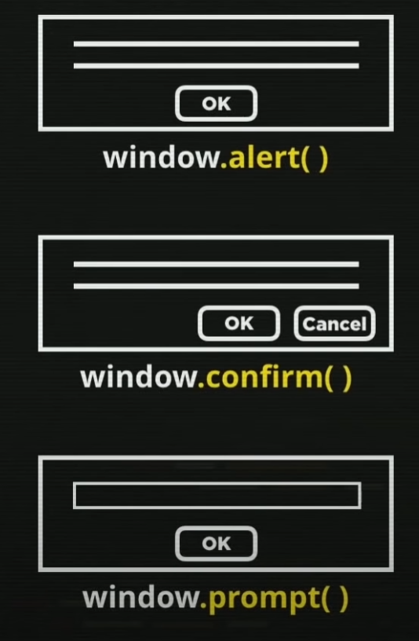

**ONDE:**
- window.alert('') ou alert('') = mostra apenas uma mensagem no navegador.
- window.confirm('') = mostra uma pergunta no navegador.
- window.prompt('') = pede para inserir um valor ou mensagem na caixa de texto mostrada no navegador.

**COMENTARIO**

**IDENTIFICADORES**

## AULA 06 ##

**Convertendo String em Número:**

é necessário a conversão de String para número no caso de operções matemáticas, pois o window.prompt entenderá que: Ex. n1 + n2 (n1 estará concatenando com n2) ou seja, se n1 = 2 e n2 = 1 na operaçao n1 + n2 será 21. Logo após a conversão será 3.

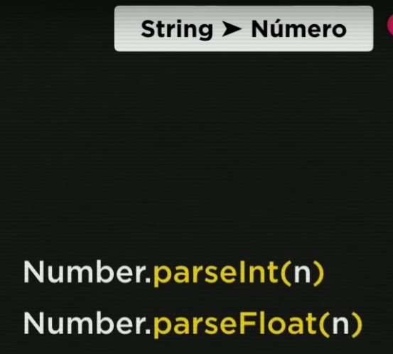

**EXEMPLO:**

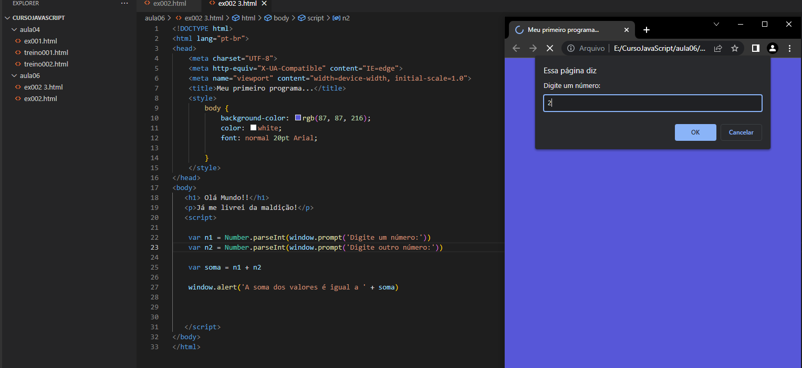

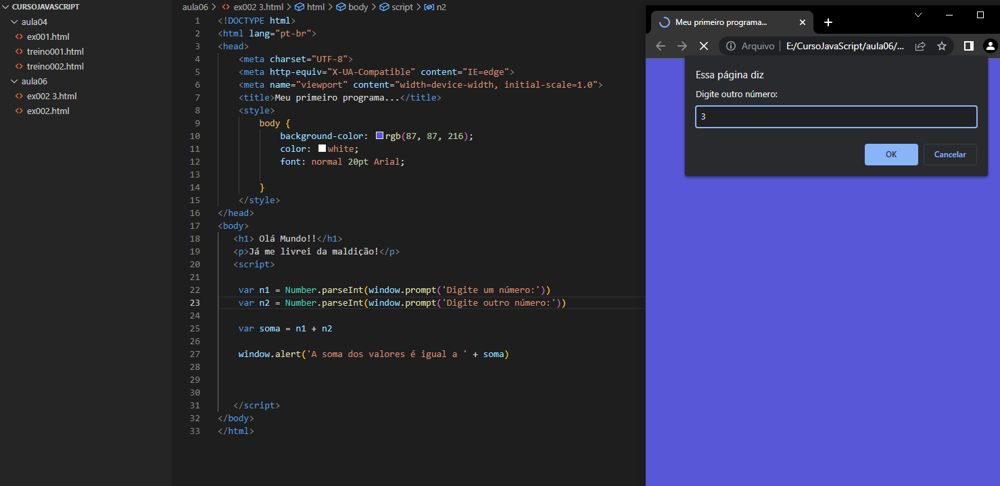

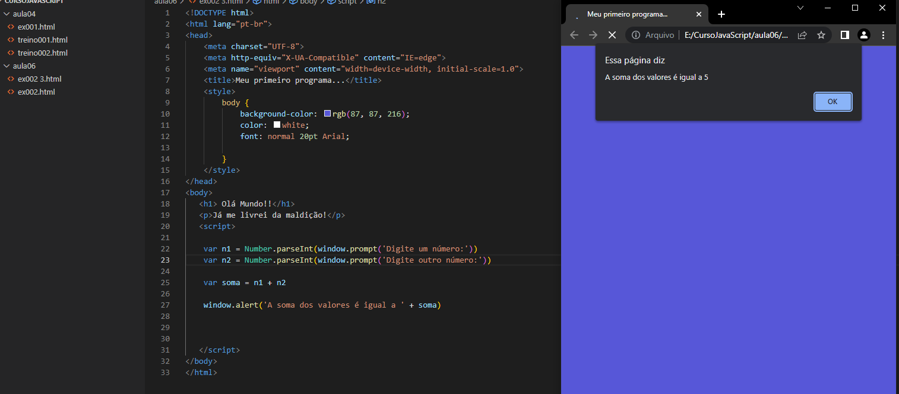

**A CONVERSÁO PODE SER FEITA TAMBÉM UTILIZANDO APENAS O NUMBER(n)**

**EXEMPLO:**

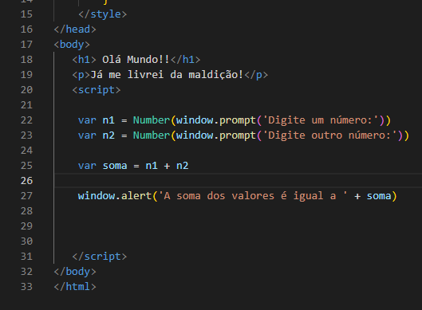

**CONVERTER NÚMERO PARA STRING:**

Utilizando **String(n)** ou **n.toString()**

Organizar Código

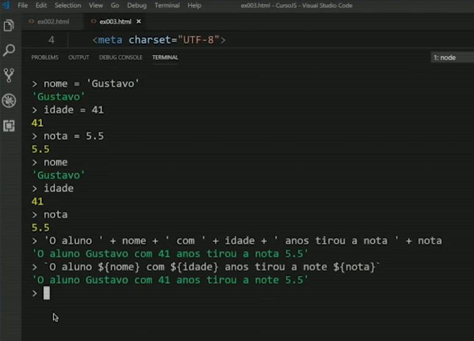

**Formatando String**

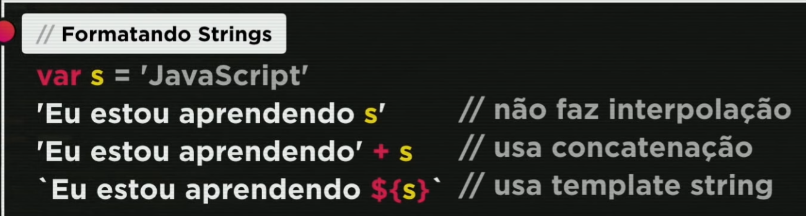

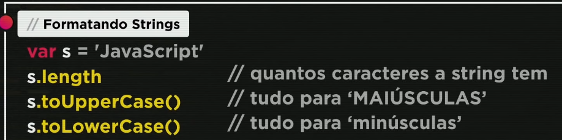

**Formatando VALORES EM MOEDA**

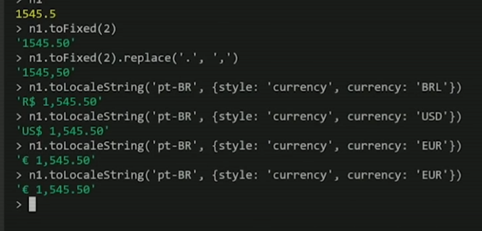

**Ordem de precedência:**

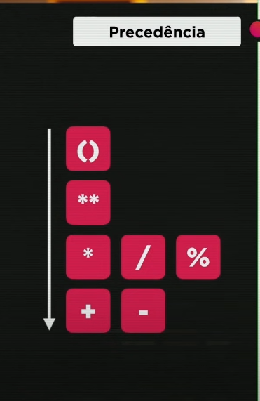

# **Incremento**

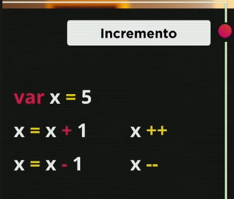

# **Identidade**

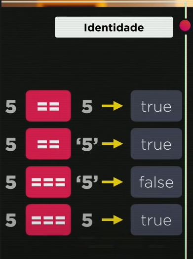
